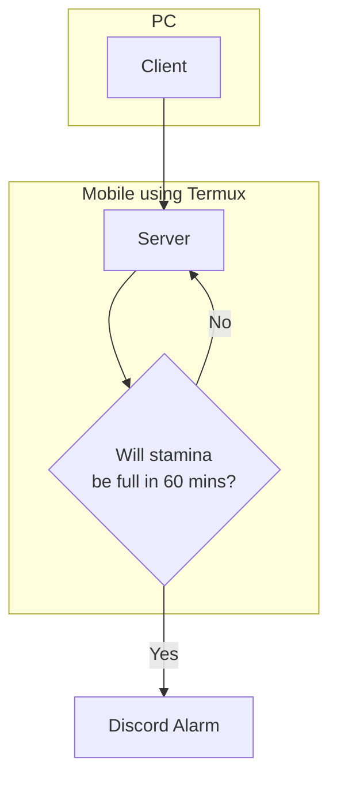
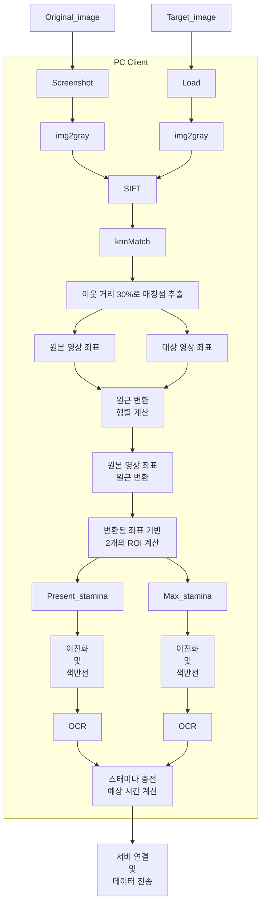
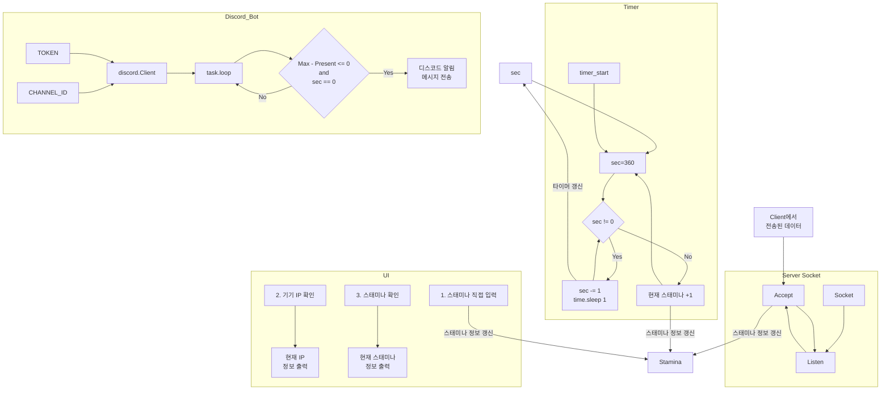

# Game-Stamina-Alarm
## 프로젝트 요약
게임화면을 인식하여 스태미나를 확인하고 예정된 시각에 사용자에게 알람을 보내주는 프로젝트입니다.

## 구현 방법
### Client

SIFT 검출기로 특징 영역 추출, knnMatch를 통한 매칭점 추출, homography matrix계산은 다음 링크를 참고하였습니다.  
[OpenCV - 29. 올바른 매칭점 찾기](https://bkshin.tistory.com/entry/OpenCV-29-%EC%98%AC%EB%B0%94%EB%A5%B8-%EB%A7%A4%EC%B9%AD%EC%A0%90-%EC%B0%BE%EA%B8%B0)  
 
OCR과정은 Tesseract OCR을 사용하였습니다.  
[tesseract github](https://github.com/UB-Mannheim/tesseract)  

### Server

서버는 모바일 환경에서 Termux라는 어플을 사용하여 Python코드를 구동하여 구축하였습니다.    
[Termux 앱으로 안드로이드 폰으로 SSH 서버 환경설정](https://oopaque.tistory.com/84)  

## 실제 동작
### Client
#### 이미지 인식 기능 시각화
 
- 좌측 이미지: 찾으려는 타겟 이미지
- 청색 사각형: 스크린샷(원본 이미지)에서 찾아낸 타겟 이미지
- 적·녹색 사각형: 찾아낸 타겟 이미지 기반 상대 좌표로 설정한 OCR을 위한 ROI
#### Client UI
 
간단한 리모컨의 형태입니다.

### Server
 
Termux를 사용해 서버 로그와 UI가 출력됩니다.
