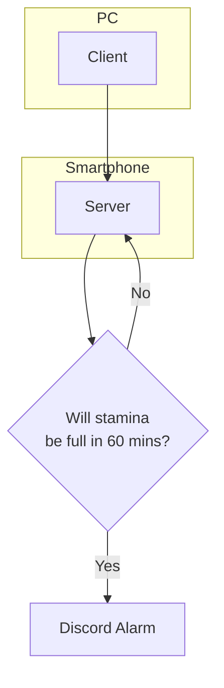

# Game-Stamina-Alarm

```mermaid
graph TB;
    subgraph PC;
    Client;
    end;
    subgraph Smartphone;
    Client-->Server;
    end;
    Server-->Condition{"Will stamina\nbe full in 60 mins?"};
    Condition-->|"No"|Server;
    Condition-->|"Yes"|Alarm["Discord Alarm"];
```
