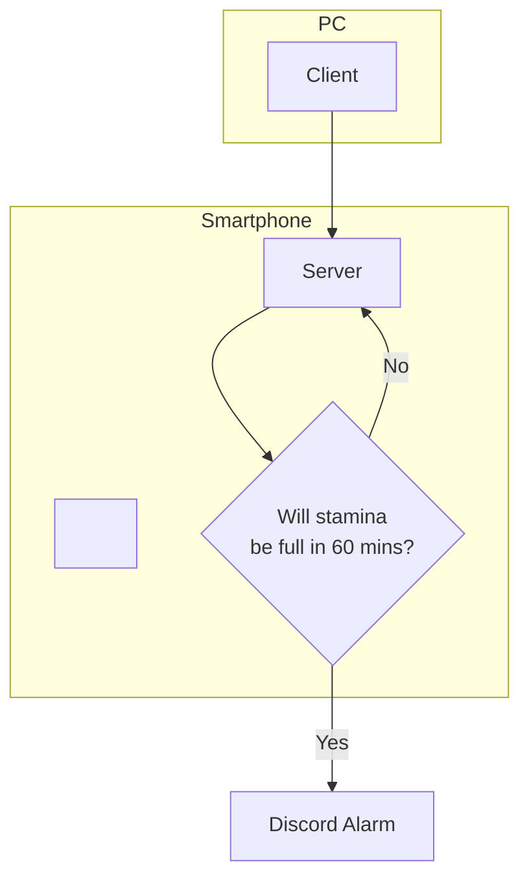

# Game-Stamina-Alarm
## 프로젝트 요약
게임화면을 인식하여 스태미나를 확인하고 예정된 시각에 사용자에게 알람을 보내주는 프로젝트입니다.

```mermaid
graph TB;
    subgraph PC;
    Client;
    end;
    subgraph Smartphone&nbsp;&nbsp;&nbsp;
    Client-->Server;
    Server-->Condition{"Will stamina\nbe full in 60 mins?"};
    end;
    Condition-->|"No"|Server;
    Condition-->|"Yes"|Alarm["Discord Alarm"];
```

## 구현 방법
### Client
### Server
