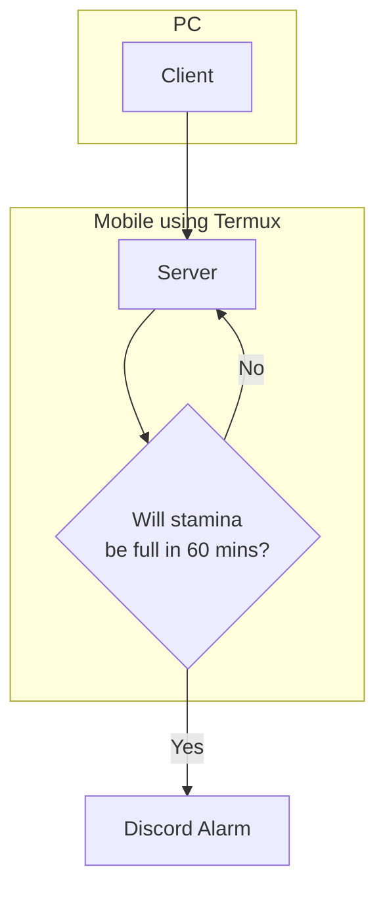
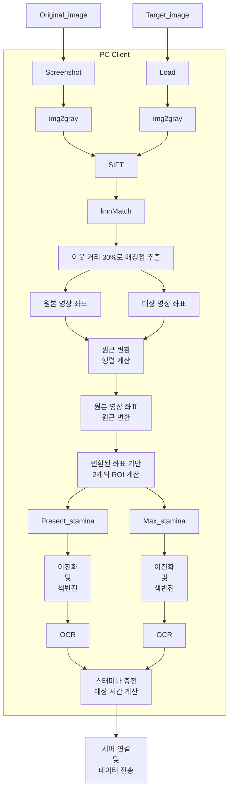
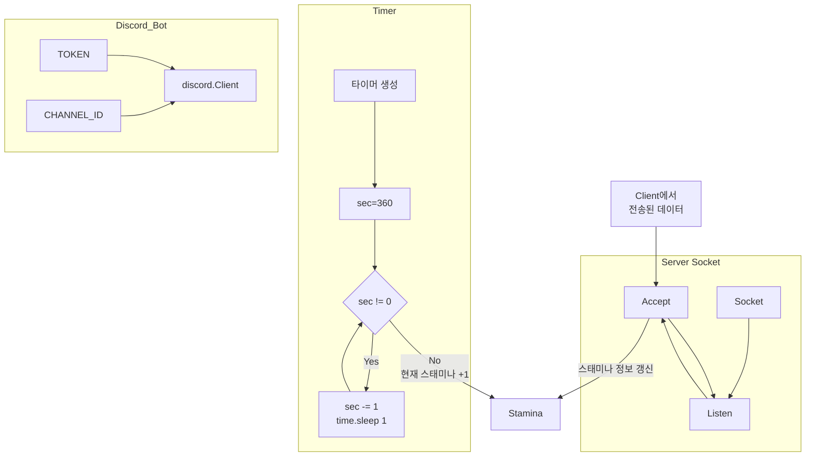

# Game-Stamina-Alarm
## 프로젝트 요약
게임화면을 인식하여 스태미나를 확인하고 예정된 시각에 사용자에게 알람을 보내주는 프로젝트입니다.

## 구현 방법
### Client

SIFT 검출기로 특징 영역 추출, knnMatch를 통한 매칭점 추출, homography matrix계산은 다음 링크를 참고하였습니다.  
[OpenCV - 29. 올바른 매칭점 찾기](https://bkshin.tistory.com/entry/OpenCV-29-%EC%98%AC%EB%B0%94%EB%A5%B8-%EB%A7%A4%EC%B9%AD%EC%A0%90-%EC%B0%BE%EA%B8%B0)  
 
OCR과정은 Tesseract OCR을 사용하였습니다.  
[tesseract github](https://github.com/UB-Mannheim/tesseract)  

### Server

